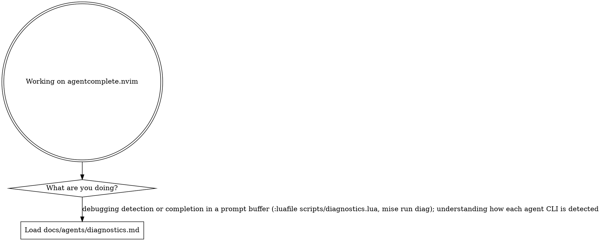

# agentcomplete.nvim — agent guidance

agentcomplete completes an agent CLI's skills, commands, and files inside the prompt
buffer that CLI opens in Neovim (Claude Code via `Ctrl+G`, OpenCode via `/editor`).
Detailed references live in [`docs/agents/`](docs/agents/) and load **on demand** — the
Routing section below is the router that decides which a given task needs. The CodeGraph
and Verifying-changes sections beneath it are always-on context for this project.

## Routing

Read the digraph as a checklist, not a single path: start from what you're doing and load
every reference whose edge matches. Read the matching `docs/agents/*.md` file into context
*before* you act on that area, not after.

## CodeGraph

**First check.** If `.codegraph/` doesn't exist in this repo, ask once:
*"This project doesn't have CodeGraph initialized — want me to run `codegraph init -i`?"*
If they decline or skip, ignore the rest of this section.

**The habit to override.** When `.codegraph/` exists, `codegraph_*` is the default for any
question about symbols, call graphs, or "how does X work" — not grep + Read. Codegraph IS
the pre-built index: a full AST parse already sitting in SQLite, sub-millisecond reads. If
you're about to grep for a function name or Read a file to find a definition, stop —
`codegraph_search` / `codegraph_context` is one call and returns more (kind, location,
signature, docstring).

Grep and Read are for **literal text** — log messages, comments, string contents — or
files you already have open.

The detailed tool-selection table and common chains live in the codegraph MCP server's own
instructions, which are already loaded into every session. This section adds the
project-level emphasis those instructions can't carry: *when* to reach for codegraph in
the first place.

### Worked example

User: *"How does auth work in this repo?"*

- **Wrong reflex**: `grep -ri "auth" .`, Read four files, maybe spawn an Explore subagent
  to make sense of it.
- **Right reflex**: `codegraph_context("authentication")` → if more breadth is needed, one
  `codegraph_explore` over the symbols it surfaced. Two calls, done. Spawning a subagent
  here repeats work the index already did.

### Red flags — you're about to skip codegraph

| Thought | Reality |
| --- | --- |
| "I'll just grep quickly to find it" | `codegraph_search` is faster and returns kind + location + signature in one call. |
| "Let me Read the file first to orient" | If you're looking up a symbol, `codegraph_node` returns just that symbol's source. |
| "I'll spawn an Explore subagent" | Codegraph IS the pre-built index — the agent would re-derive what's already indexed. |
| "Let me verify the codegraph result with grep" | Don't. AST parse beats text search; re-verifying wastes context. |
| "I'll chain `codegraph_search` then `codegraph_node`" | Use `codegraph_context` — one call instead of two. |

### Index lag

The file watcher debounces ~500ms behind writes. Don't re-query codegraph immediately
after editing a file in the same turn — give it a beat, or trust your edit.

## Verifying changes

`mise run preflight` is the pre-push gate. It is a thin wrapper declared as
`depends=["lint", "test"]`, so mise runs `lint` then `test`; reaching the end prints
`preflight: lint + test passed`. There is no `--json` mode, no build step, and no extra
flags — when a task fails, run it directly to see its full output and narrow the failure:

- `mise run lint` — read-only checks via `hk check --all`: stylua (format), selene (lint
  hygiene), lua-language-server (LuaCATS type-check), plus rumdl (markdown), taplo (TOML),
  and shellcheck (shell).
- `mise run test` — the headless Neovim + mini.test suite. `mise run test -f <file>` runs
  a single file (e.g. `mise run test -f tests/test_detect.lua`).
- `mise run format` — apply formatting in write mode (the counterpart to `lint`'s check).
- `mise run diag` — print the diagnostics report headlessly; see
  [`docs/agents/diagnostics.md`](docs/agents/diagnostics.md).

A `pre-commit` hook formats and lints staged files; a `pre-push` hook runs the tests.
