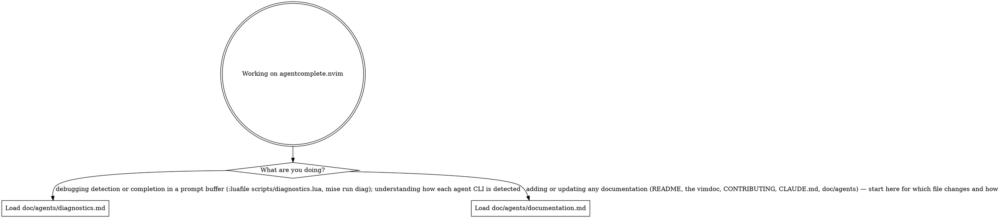

# agentcomplete.nvim — agent guidance

agentcomplete completes an agent CLI's skills, commands, and files inside the prompt
buffer that CLI opens in Neovim (Claude Code via `Ctrl+G`, OpenCode via `/editor`).
Detailed references live in [`doc/agents/`](doc/agents/) and load **on demand** — the
Routing section below is the router that decides which a given task needs. The
Verifying-changes section beneath it is always-on context for this project.

## Routing

Read the digraph as a checklist, not a single path: start from what you're doing and load
every reference whose edge matches. Read the matching `doc/agents/*.md` file into context
*before* you act on that area, not after.

## Verifying changes

`mise run preflight` is the pre-push gate. It is a thin wrapper declared as
`depends=["lint", "test"]`, so mise runs `lint` then `test`; reaching the end prints
`preflight: lint + test passed`. There is no `--json` mode, no build step, and no extra
flags — when a task fails, run it directly to see its full output and narrow the failure:

- `mise run lint` — read-only checks via `hk check --all`: selene (lint hygiene),
  lua-language-server (LuaCATS type-check), oxlint (TypeScript lint), tsc (TypeScript
  type-check), plus rumdl (markdown), taplo (TOML), pkl, and shellcheck (shell). No
  formatter runs here — `hk check` is the linters only.
- `mise run test` — the headless Neovim + mini.test suite. `mise run test -f <file>` runs
  a single file (e.g. `mise run test -f tests/test_detect.lua`).
- `mise run format` — apply formatting in write mode (the counterpart to `lint`'s check).
- `mise run diag` — print the diagnostics report headlessly; see
  [`doc/agents/diagnostics.md`](doc/agents/diagnostics.md).

A `pre-commit` hook formats and lints staged files; a `pre-push` hook runs the tests.
