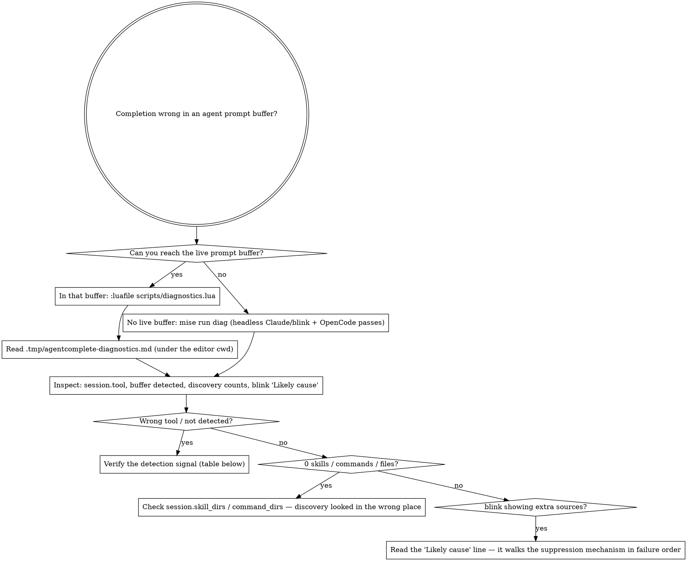

# Diagnosing agentcomplete

agentcomplete attaches completion to the prompt buffer an agent CLI opens in Neovim. An
agent session can't launch a second Neovim from itself to watch the plugin, so when
completion misbehaves there ("no completions", "wrong sources", "not detected") the
diagnostics module dumps the live plugin state to a file the agent can read back. This is
the loop to follow before guessing at a fix.

## Workflow

## Detection signals

How each tool's prompt buffer is recognized (detectors live under
`lua/agentcomplete/detect/`):

| Tool | Signal | cwd |
| --- | --- | --- |
| Claude Code | buffer name matches `claude-prompt-<uuid>.md` | editor cwd (project root) |
| OpenCode | `vim.env.OPENCODE == "1"` (set for every OpenCode command, inherited by the spawned editor) **and** buffer basename matches `<digits>.md` | editor cwd (project root) |

Both honor `$AGENTCOMPLETE_CWD` / `vim.g.agentcomplete_cwd` to override the cwd.
OpenCode's temp file has no tool-specific name — it is a bare `<epoch-millis>.md` in the
system temp dir — which is why detection keys on the inherited `OPENCODE` env var rather
than the buffer name.

## What the report contains

- `## Config` — configured vs. resolved backend, detect mode, `enabled`, the `sources`
  toggles, and `allowed_sources`.
- `## Detection` — whether the current buffer is detected, the session source, the
  resolved `session.tool`, and the `skill_dirs` / `command_dirs` discovery actually
  searched.
- `## Discovery` — counts for the active session,
  **one line per source rather than a total**, because a healthy-looking sum is how a
  discovery path that searched the wrong directory hides (the static built-ins alone put
  ~17 on the commands line while the filesystem scan found nothing). A zero beside a
  source that should have items is the finding. Skills come from the filesystem scan and
  `opencode debug skill`; commands from the filesystem scan, `opencode debug config`, and
  the `opencode.json[c]` map plus static built-ins. The two CLI counts are async (see
  `lua/agentcomplete/opencode_cli.lua`): they populate ~1s after the buffer attaches, so a
  live `:luafile` run shows them, but a fresh `mise run diag` (which exits immediately)
  reports 0 for both.
- `## Highlighting` — whether token highlighting is attached to this buffer, how many
  tokens are currently painted, what `AgentCompleteSkill` and `AgentCompleteFile` resolve
  to (the group each links to, or `(explicit)` when the user set attributes directly —
  suffixed `(no effective attributes)` when that chain ends somewhere empty), and the size
  of the resolved `/` set, the names a `/token` is checked against. Start here when tokens
  go uncolored: an uncolored token is the plugin's signal for "does not resolve", and the
  painted count is what separates a token that never resolved from one painted in a group
  the colorscheme renders invisibly.
- `## Context` — what the last-message pane resolved for this buffer: the `resolver` that
  claimed the session, the `session id` and `transcript` it read, the message's size in
  `bytes`, and the `last error`. `(no context resolved)` means resolution never ran for
  this buffer — the feature is off, there is no UI to split, Claude Code's own
  `externalEditorContext` already rendered into the prompt buffer, or nothing attached. A
  populated `last error` beside `(unset)` fields is a resolution that either failed or
  never started. Only the first kind is also in `.tmp/agentcomplete-context.log`:
  `no resolver for tool <x>` is normal operation for a tool whose resolver has not shipped
  yet, so it is recorded here and nowhere else. A `mise run diag` pass always reports
  `(no context resolved)`: headless runs open no pane by design.
- `## blink suppression` — the only-source suppression diagnosis, ending in a single
  "Likely cause" line that walks the mechanism in the order failures actually occur, so it
  points straight at the fix.
- `## Environment` — the raw detection signals (`OPENCODE`, `OPENCODE_PID`, `AGENT`,
  `CLAUDE_CODE_SESSION_ID`, `$AGENTCOMPLETE_CWD`, `$OPENCODE_CONFIG_DIR`,
  `$XDG_CONFIG_HOME`, …).

## Running it

- **From a live prompt buffer** (the real one the agent opened):
  `:luafile scripts/diagnostics.lua` — optionally `:AgentCompleteAttach` first to force a
  session if the buffer wasn't auto-detected. It writes
  `.tmp/agentcomplete-diagnostics.md` under the editor's working directory and prints the
  report to `:messages`.
- **Headless, with no live buffer**: `mise run diag` runs the same flow in two passes — a
  Claude Code / blink pass against a real blink setup (validating that only-source
  suppression removes `path`) and an OpenCode pass (`OPENCODE=1` on a `<digits>.md`
  buffer, confirming detection reports `session.tool: opencode` with the resolved OpenCode
  search dirs).
