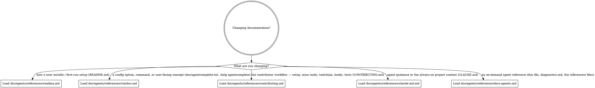

# Documenting agentcomplete

**Audience: agents.** agentcomplete's documentation is split by reader, so a change rarely
belongs in just one file and almost never in the file you first reach for. This is the
router: it decides which doc a documentation change belongs in and hands you the reference
that describes how to edit it. Read it before editing any documentation, then load the one
`doc/agents/references/*.md` whose edge matches.

## Routing

Read the digraph as a checklist, not a single path: a change can touch more than one doc
(e.g. a new option needs the vimdoc reference *and*, if it changes install, the README
reference). Load every reference whose edge matches before editing.

## The documentation surface

| File | Audience | What lives there |
| --- | --- | --- |
| [`README.md`](../../README.md) | plugin users | Installation only: requirements, install snippets, the setup gotchas that block first-run success, and pointers onward. |
| [`doc/agentcomplete.txt`](../../doc/agentcomplete.txt) | plugin users | The full reference (`:help agentcomplete`): detection, every config option, blink/native backends, suppression, commands, in-buffer diagnostics. |
| [`CONTRIBUTING.md`](../../CONTRIBUTING.md) | human developers | How to set up, test, and run the plugin from a checkout — mise, the task catalog, the Lua toolchain, git hooks, the headless diagnostics flow. |
| [`CLAUDE.md`](../../CLAUDE.md) | agents | Agent guidance: the routing digraph plus always-on project context (verifying changes). |
| [`doc/agents/`](../) | agents | On-demand references loaded via the CLAUDE.md routing digraph (diagnostics, this documentation hub, and the `references/` files). |

## How to edit

Every reference under [`references/`](references/) names the target file's audience, says
what belongs in it versus elsewhere, and tells you to draft the change with the
`/doc-coauthoring` skill when it is available. The boundary between files is the thing to
protect: keep README install-only, keep the vimdoc the home for concepts and options, keep
CONTRIBUTING contributor-only, and keep CLAUDE.md / `doc/agents/` agent-facing. When a
change crosses a boundary, split it across the right files rather than letting one file
grow out of its audience.
